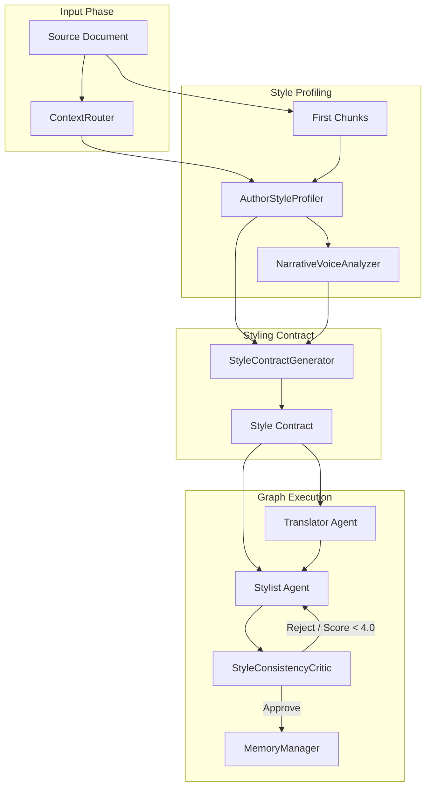

# TIE v0.3: Style Intelligence Layer (Design Specification)

## 1. Introduction & Objectives
While TIE v0.2 successfully addressed scope isolation and quality control for terminology, literary translations can still feel dry, generic, and overly literal. A correct glossary translation is not enough to capture an author's unique narrative signature.

**TIE v0.3** introduces the **Style Intelligence Layer**, which shifts the platform from simple vocabulary alignment to **narrative voice replication**. The system will autonomously extract, contract, and critique the translation's style, voice, rhythm, and prose density, ensuring that distinct authors (such as Cormac McCarthy's bleak, biblical minimalism) retain their literary force.

---

## 2. Component Architecture



### 2.1. AuthorStyleProfiler
The `AuthorStyleProfiler` is responsible for building a persistent, multi-dimensional signature of a specific yazar's prose style.

*   **Known Author Profile (Cold Start):** Checks `memory/global/authors/{author_id}.json`. If a pre-configured or curated profile exists, it is loaded immediately.
*   **Inferred Author Style (Zero Shot/Dynamic):** If no profile exists, the profiler analyzes the first 2 chunks of the source text using a structured LLM call to extract style attributes (fragmentation, syntactic choices, punctuation rules).
*   **Attributes Analyzed:**
    *   Syntactic patterns (hypotaxis vs. parataxis)
    *   Vocabulary register (e.g., archaic, biblical, colloquial, clinical)
    *   Punctuation preferences (e.g., omission of quotation marks, commas)

### 2.2. NarrativeVoiceAnalyzer
The `NarrativeVoiceAnalyzer` evaluates fine-grained narratological dynamics within the text slice:

*   **Narrative Tone:** Explores emotional distance (e.g., objective, distant third-person vs. subjective, intimate).
*   **Sentence Rhythm:** Explores cadence, length distributions (e.g., long rolling coordinate clauses connected by "and" vs. short abrupt pulses).
*   **Fragment Density:** Tracks the use of incomplete sentences.
*   **Language Register Level:** Scale from archaic/literary to modern/plain.
*   **Dialogue Density:** Frequency and formatting conventions of spoken dialogue.
*   **Imagery Density:** Abundance of metaphors, sensory details, and atmospheric descriptions.

### 2.3. StyleContractGenerator
Before translation execution starts, the system compiles a yazar/work-specific **Style Contract**. The contract acts as a strict "ground truth" rulebook injected into the translation agents' prompts.

*   **Scenic Mapping:** Map literal expressions to active Turkish theatrical verbs.
    *   *Example:* `"See the child."` mapped to `"Karşınızda çocuk."` or `"Çocuğa bakın."` (scenic presentation) instead of plain literal translation `"Çocuğu görün."` (which sounds like an instructional directive).
*   **Constraint Safeguards:**
    *   "Short fragments must be preserved as separate sentence pulses."
    *   "Do not insert explanatory clauses or filler conjunctions (e.g., 'çünkü', 'fakat') to bridge McCarthy's coordinate structures."
    *   "Maintain bleak, sparse atmospheric rhythm."

### 2.4. StyleConsistencyCritic
An advanced evaluator integrated into the LangGraph workflow that checks style compliance.

*   **Axis Scoring (0.0 to 5.0):**
    1.  `style_preservation`: Adherence to the yazar style guide and specific yazar heuristics.
    2.  `rhythm_preservation`: Compliance with sentence lengths, fragments, and pacing constraints.
    3.  `voice_consistency`: Stability of narrative tone and lexical register across chunks.
    4.  `literary_force`: Impact and scenic fidelity in Turkish compared to the original English tone.
*   **Execution Rule:** If any score falls below **4.0/5.0**, the critic rejects the chunk, generates stylistic feedback pointing out specific breaches (e.g., "Sentence was artificially combined using 'çünkü'; break it back into fragments"), and routes execution back to the Stylist agent.

---

## 3. Data & Memory Schema Updates

We will store style-related memories in isolated directories under `memory/global/authors/` and `memory/works/{work_id}/style/`.

### 3.1. Author Style Profile (`author_style`)
File Path: `memory/global/authors/{author_id}.json`
```json
{
  "author_id": "cormac_mccarthy",
  "author_name": "Cormac McCarthy",
  "type": "author_style",
  "attributes": {
    "syntax": "paratactic, coordinate clauses linked by 'and', high usage of polysyndeton",
    "punctuation": "omission of apostrophes in contractions (dont, cant), omission of quotation marks, minimal commas",
    "tone": "bleak, biblical, severe, epic, emotionally detached",
    "vocabulary": "archaic, geological, botanical, theological, stark"
  },
  "inferred": false,
  "confidence": 1.0,
  "usage_count": 5
}
```

### 3.2. Narrative Voice & Contract (`style_contract`)
File Path: `memory/works/{work_id}/style/style_contract.json`
```json
{
  "work_id": "blood_meridian",
  "type": "style_contract",
  "narrative_voice": {
    "tone": "gothic, apocalyptic, distant third-person narration",
    "sentence_rhythm": "rhythmic cadence resembling the King James Bible, alternating with stark fragmentary descriptions",
    "fragment_density": "high",
    "language_register": "archaic, nineteenth-century American frontier Turkish equivalent",
    "dialogue_density": "medium, unlabeled dialogues",
    "imagery_density": "high, heavy atmospheric details"
  },
  "constraints": [
    "Preserve intentional line breaks and sentence fragments. Do not combine them into compound Turkish sentences.",
    "Do not add explanatory Turkish conjunctions (e.g. 'ise', 'çünkü', 'yani') that soften the stark narration.",
    "Translate scenic imperatives (e.g. 'See the child.') into direct scenic presentation ('Çocuğa bakın.' / 'Bakın çocuk.') rather than cognitive statements ('Çocuğu görün.')."
  ],
  "lexical_register_rules": [
    {
      "english_pattern": "say",
      "turkish_equivalent": "şöyle der",
      "context": "dialogue introductions without quotation marks"
    }
  ]
}
```

---

## 4. Integration Plan

### 4.1. ContextRouter Extension
The `ContextRouter` will resolve style memory hierarchy alongside glossary items:
1.  Check for `author_style` in `memory/global/authors/{author_id}.json` using yazar metadata.
2.  Check for `style_contract` in `memory/works/{work_id}/style/style_contract.json`.
3.  Inject the loaded style rules under a dedicated section `### Style & Narrative Voice Guidelines` within the compact context.

### 4.2. Agent Prompt Adjustments
*   **Translator Agent:** Learns structural constraints (e.g., parataxis, fragment preservation) to build the draft correctly on the first pass.
*   **Stylist Agent:** Learns fine-grained rhythm rules, stylistic constraints, and yazar-specific punctuation rules (like stripping Turkish quotation marks if requested by yazar profile).
*   **StyleConsistencyCritic Agent:** Ingests the `style_contract` and evaluates the output strictly against the defined axes.

### 4.3. Handoff Extension (`translation_handoff.md`)
The TIE Handoff file will export the resolved Style Contract and style metadata:
*   **Style Signature Summary:** Author name and list of core voice characteristics.
*   **Syntactic Directives:** Specific rules on sentence lengths, fragments, and rhythm.
*   **Punctuation Decisions:** Explicit confirmation of styling choices (e.g., quotes omitted).

### 4.4. Observability Updates
*   **MLflow Metrics:**
    *   `style_preservation_score` (float, 0-5)
    *   `rhythm_preservation_score` (float, 0-5)
    *   `voice_consistency_score` (float, 0-5)
    *   `literary_force_score` (float, 0-5)
    *   `style_critic_rejection_count` (integer)
*   **Langfuse Traces:**
    *   Spans for `AuthorStyleProfiler` inference.
    *   Spans for `StyleContractGenerator` compilation.
    *   Spans for `StyleConsistencyCritic` evaluations.

---

## 5. Verification & Unit Tests Plan

We will implement the following automated test cases in `tests/test_tie_v03.py`:

1.  `test_author_style_profiler_extraction()`
    *   Feeds a stark passage (McCarthy) to `AuthorStyleProfiler`.
    *   Asserts that attributes like "biblical", "parataxis", or "bleak" are extracted and stored.
2.  `test_style_contract_generation()`
    *   Validates that the contract includes mandatory syntactic constraints (like scenic presentation mapping).
3.  `test_style_consistency_critic_rejection()`
    *   Simulates a stylized English input translated into a flat, explanatory, run-on Turkish sentence.
    *   Asserts that `StyleConsistencyCritic` scores it under 4.0 and triggers a rejection feedback loop.
4.  `test_style_isolation_across_works()`
    *   Asserts that translation of a technical paper does not load or apply McCarthy's stylistic contract.

---

## 6. Blood Meridian Benchmark: "See the child."

To demonstrate the difference between TIE v0.2 and TIE v0.3, here is a detailed benchmark comparison of the famous opening line of *Blood Meridian*:

### Source Text
> "See the child. He is pale and thin, he wears a thin and ragged linen shirt."

### TIE v0.2 Execution (Terminology only)
*   **Context Loaded:** Glossary mappings (`child` -> `çocuk`, `linen` -> `keten`).
*   **Draft translation:** `"Çocuğu görün. O solgun ve zayıf, ince ve yırtık pırtık bir keten gömlek giyiyor."`
*   **Critic Decision:** Approved (Accurate terminology, grammatically correct).
*   **Deficit:** The translation is dry and flat. `"Çocuğu görün"` acts as a literal instructional imperative (like "observe the child"), missing the biblical cadence and dramatic scene-setting of `"See the child."`. The run-on coordinate clauses are translated with a standard Turkish relative structure.

### TIE v0.3 Execution (Style Intelligence Layer)
*   **Context Loaded:**
    *   Author Style Profile: Cormac McCarthy (Apocalyptic tone, parataxis, biblical register).
    *   Style Contract:
        *   "See the child." -> Scenic presentation ("Bakın çocuk." or "Karşınızda çocuk.").
        *   Do not soften stark coordinate clauses. Keep sentence segments simple and distinct.
*   **Draft translation:** `"Karşınızda çocuk. Solgun ve cılız; keten gömleği incecik ve paramparça."`
*   **Critic Evaluation:**
    *   `style_preservation`: 4.8/5
    *   `rhythm_preservation`: 4.7/5
    *   `voice_consistency`: 4.9/5
    *   `literary_force`: 4.8/5
    *   **Decision:** Approved.
*   **Result:** The prose is stark, atmospheric, and punchy. `"Karşınızda çocuk."` sets the gothic narrative stage immediately, mirroring the literary force of the original English text.
